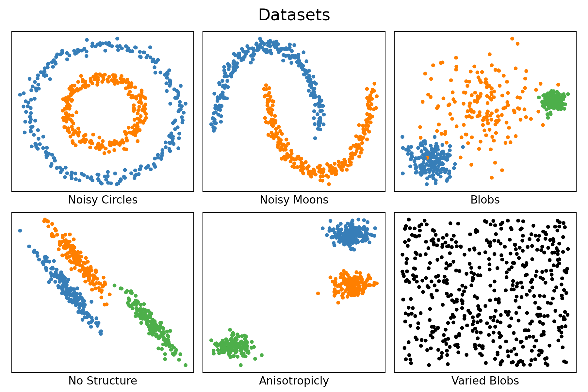
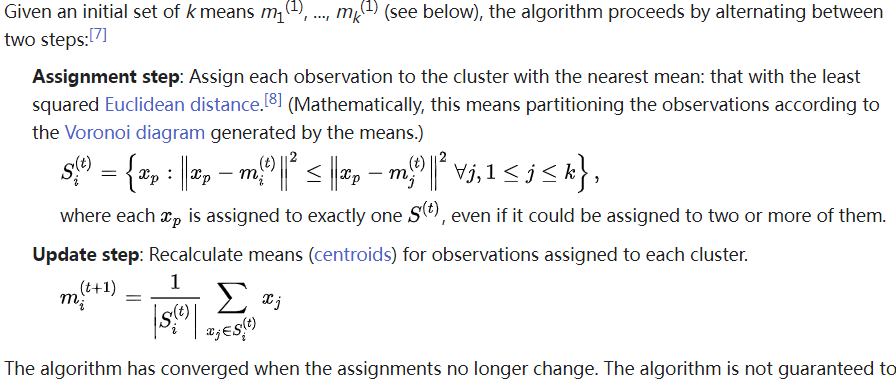
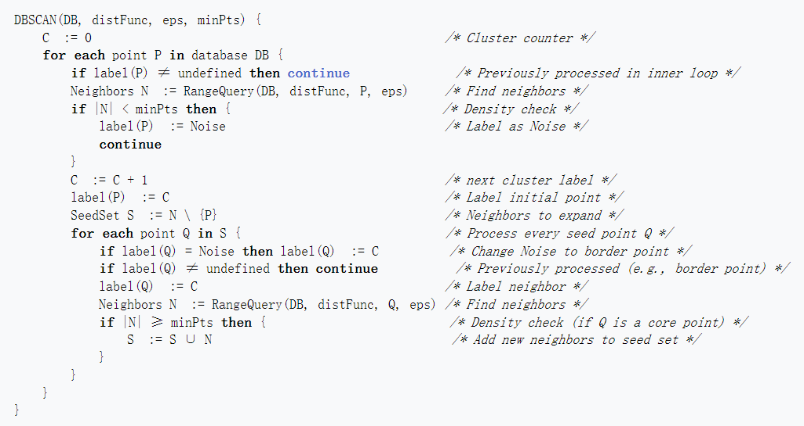
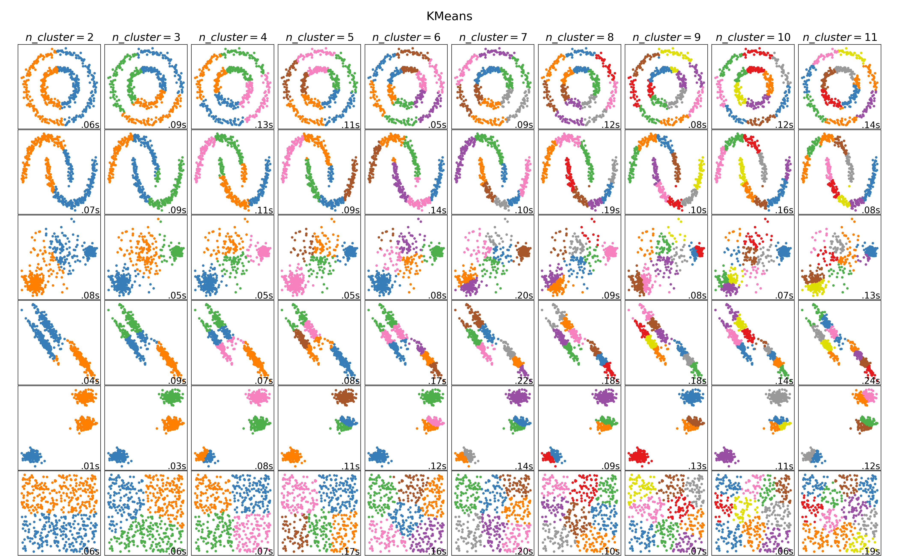
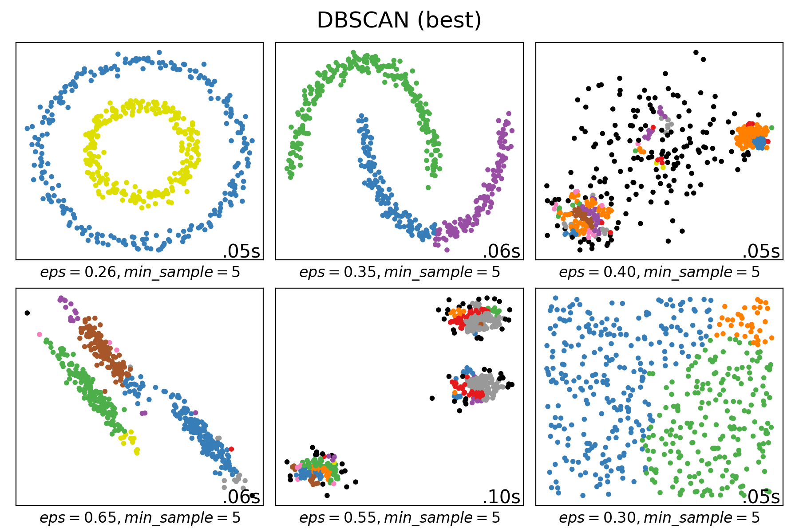
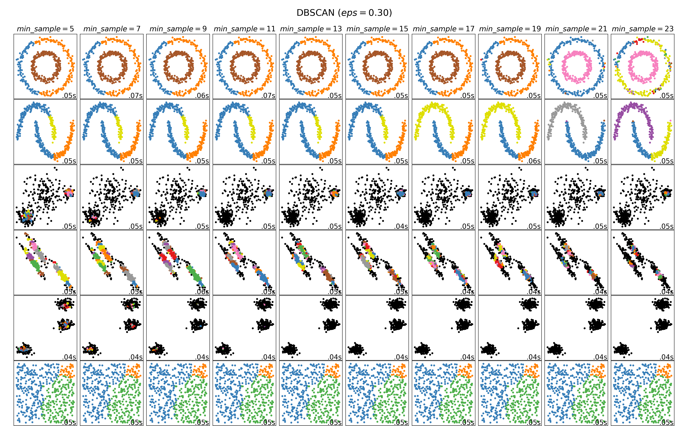
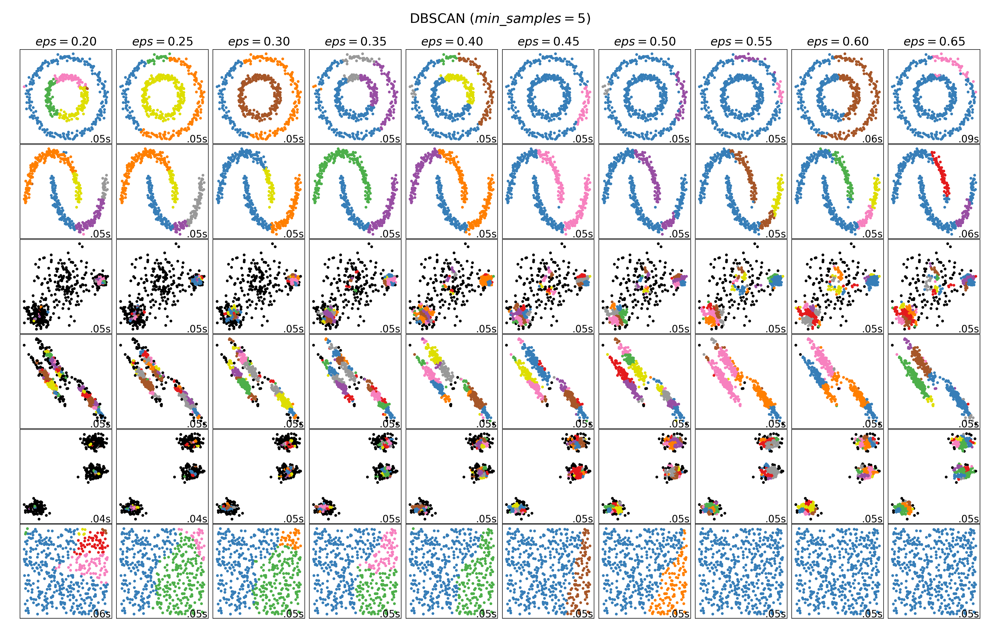
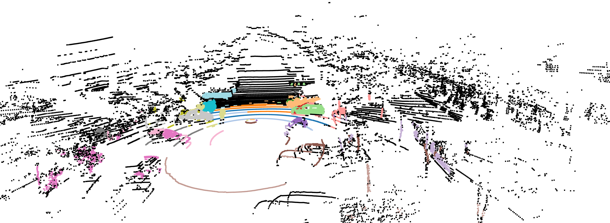

# Final Project Report
Final Project - Clustering Algorithms

AU7008 Data Mining, SJTU, 2023 Spring

By **Prof. X. He**

 

**Table of Contents**
<!-- MarkdownTOC -->

- [Final Project Report](#final-project-report)
    - [Problem Specification](#problem-specification)
    - [Implementation](#implementation)
      - [K-Means](#k-means)
      - [DBSCAN](#dbscan)
    - [Experiment](#experiment)
      - [K-Means (Overall + Sensitivity to `n_clusters`)](#k-means-overall--sensitivity-to-n_clusters)
      - [DBSCAN](#dbscan-1)
        - [Overall](#overall)
        - [Sensitivity to `min_samples`](#sensitivity-to-min_samples)
        - [Sensitivity to `eps`](#sensitivity-to-eps)
        - [Sample Application to 3-D Point Cloud](#sample-application-to-3-d-point-cloud)
    - [Appendix - Codes](#appendix---codes)

<!-- /MarkdownTOC -->

 

### Problem Specification

> Implement one/two clustering algorithms, and test upon datasets, with regard to effectiveness and sensitivity to parameters.

The selected algorithms are K-Means and DBSCAN. For both, they will be tested on different 2-d distributions shown below,

Such an design are based on the following reasons:

+ K-Means and DBSCAN are classic clustering algorithms
  + K-Means represents algorithms that require the number of clusters, as prior knowledge
  + DBSCAN represents algorithms that does NOT require the number of clusters, as prior knowledge
+ For "advanced"-alike clustering problems (e.g., unsupervised classification of handwritten numbers), the fundamental idea is clustering the reduced-dimension feature vectors. Therefore, the performance of dimension-reduction algorithms (e.g., PCA, t-SNE, etc.) will influence the overall outputs. To target the clustering problem, we choose NOT to introduce such factors.

### Implementation

#### K-Means

The description of K-Means are given as follows (source: [Wikipedia](https://en.wikipedia.org/wiki/K-means_clustering)),

In practice, details include,

+ implement using the standard algorithm version (naive k-means)
+ convergence criteria is: the Frobenius norm of the difference of two consecutive set of cluster centroids are less than or equal to `1e-4`
+ exit criteria on divergence: `300` iterations reached
+ the distance between each sample to any centroid is Euclidean distance
+ nearest-cluster-searching is implemented using `numpy` broadcasting feature (KDTree not that necessary here)

#### DBSCAN

The pseudo-codes of DBSCAN are given as follows (source: [Wikipedia](https://en.wikipedia.org/wiki/DBSCAN)),

In practice, details include,

+ nearest-point-searching within radius is implemented using KDTree (with `leaf_size=30`)
+ Minkowski distance is used for point-to-point distance

### Experiment

Notice: the choice of parameters to analyze are based on algorithm properties and what [scikit-learn highlights](https://scikit-learn.org/stable/modules/clustering.html).

#### K-Means (Overall + Sensitivity to `n_clusters`)

The overall performance is shown as follows (black samples as noise/outlier, and the others as clusters), with various values for the parameter `n_cluster` (the number of clusters)

From which, we may observe,

+ **K-Means suffers from linearity**. As is suggested by the fact that K-Means is a linear algorithm in essence, it performs well when data samples is line-separable (row `3,4,5`), and performs bad when data samples cannot be clustered by a given set of hyper-lines (row `1,2,6`).
+ **K-Means relies heavily on parameter `n_clusters` selection**. As is depicted in row 5, samples self-evidently forms 3 clusters. Therefore, when the prior-knowledge-alike choice of `n_clusters` parameter is exactly 3, the performance is the best; while for other cases, the performance is not that satisfactory. Actually, the especial sensitivity to `n_clusters` parameter is the major concern for all such algorithms that K-Means represents. Therefore, in practice, we would better apply such methods for classification problems, i.e., the number of clusters are assumed to be known.

#### DBSCAN

##### Overall

The overall performance is shown as follows (black samples as noise/outlier, and the others as clusters), 

From which (indexed `1-6` from left to right and then top to bottom), we may observe,

+ **DBSCAN introduces non-linearity**: for non-linear distributions `1,2` (that K-Means fails on), DBSCAN performs well.
+ **DBSCAN is `n_clusters`-free and density-based**:  although DBSCAN is able to "auto-regress" the number of clusters (`1,2`), as its pseudo-codes illustrate, it tends to regard dense regions as clusters, and thus *(1)* making linear-separable distributions noisy (`3,4,5`), and *(2)* ignoring sample points in sparse regions (`3`).

Then, we assign various values to `(eps, min_sample)` pairs, to shed light on DBCAN's sensitivity to either parameter.

##### Sensitivity to `min_samples`

Firstly, by changing `min_samples`, we have the following results,

From which, we may observe,

+ **`min_samples` have little to do with the performance**, for all distributions. 

##### Sensitivity to `eps`

Secondly, by changing `eps`, we have the following results,

From which, we may observe,

+ **DBSCAN relies on proper `eps` choice**: since `eps` characterize the threshold of neighboring samples and thus characterizing the density, it self-evidently dominant the overall performance. 

##### Sample Application to 3-D Point Cloud

Though discussed in [Problem Specification](#problem-specification) that advanced applications are NOT the major concern of the experiment, we provide a simple illustration of DBSCAN being applied to the 3-D point cloud semantic segmentation task.

The point cloud is obtained using a 32-channel LiDAR, at the parking lot to the west of SEIEE buildings. In practice, we focus on objects near the car. The results are shown as follows,

From which, we may observe that DBSCAN excels at the semantic segmentation --- cars, tree trunks in brown are all clearly identified.

Notice that, due to copyright issues (lab-domain only), the detailed visualization codes are NOT included (simple though, leveraging `open3d, matplotlib`). Sample data is provided as `~/data/seq60_00000__3-297.bin`.

### Appendix - Codes

Please check the shipped compressed file of codes.

